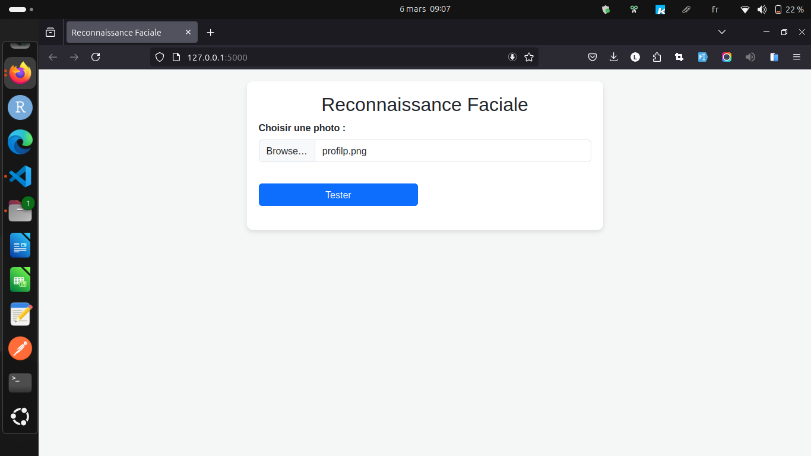
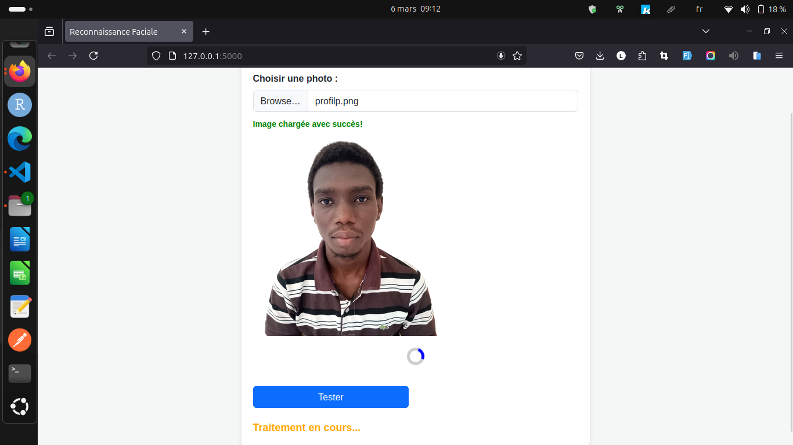

# Reconnaissance Faciale avec Flask et DeepFace :by FAMILLE DOOS

Ce projet permet de réaliser une reconnaissance faciale en utilisant Flask pour le backend et DeepFace pour la détection et l'identification des visages.

## 📌 Fonctionnalités

- Chargement d'une image via une interface web.
- Prévisualisation de l'image avant traitement.
- Reconnaissance faciale avec affichage du nom de la personne identifiée.
- Indication visuelle du traitement en cours.
- Affichage du pourcentage de confiance de la reconnaissance.

## 🛠️ Installation

### 1️⃣ Cloner le projet

```bash
git clone https://github.com/wendtoinissaka/reconnaissance_faciale_famille_doos.git
cd reconnaissance_faciale_famille_doos
```

### 2️⃣ Installer les dépendances

Assurez-vous d'avoir Python installé, puis exécutez la commande suivante pour installer les dépendances requises :

```bash
pip install -r requirements.txt
```

## 3️⃣ Lancer l'application

Démarrez le serveur Flask avec la commande suivante :

```bash
python app.py
```

L'application sera accessible via l'URL suivante : http://127.0.0.1:5000/.


## 4️⃣ Utilisation

    1. Sélectionner une image : Cliquez sur le bouton pour choisir une image depuis votre appareil.
    2. Tester la reconnaissance : Appuyez sur le bouton "Tester".
    3. Résultat affiché : L'application affichera le nom de la personne si elle est reconnue, ainsi que le pourcentage de confiance.


## 🖥️ Interface

L'interface de l'application se présente comme suit :







## 🏗️ Structure du projet

L'organisation des fichiers du projet est la suivante :

📂 reconnaissance-faciale
│── 📂 static
│   ├── 📂 css
│   │   └── styles.css
│   ├── 📂 js
│   │   └── script.js
│── 📂 templates
│   ├── index.html
│── 📂 models
│   ├── face_encodings.pkl
│── 📂 data
│   ├── 📂 known_faces
│── app.py
│── requirements.txt
│── README.md
